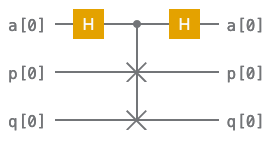

## TKET Exercises

1. Build a circuit to prepare the 3 qubit GHZ state $| \psi \rangle_{GHZ}$. Verify your circuit with `Circuit.get_statevector()` or `AerStateBackend` . 

$$
\begin{equation*}
| \psi \rangle^{(3)}_{GHZ} = \frac{1}{\sqrt{2}} \big( |000\rangle + |111\rangle \big)
\end{equation*}
$$

Can you define a function `build_ghz_circ` which builds an $n$ qubit GHZ state?

$$
\begin{equation*}
| \psi \rangle^{(3)}_{GHZ} = \frac{1}{\sqrt{2}} \big( |0\rangle^{\otimes n} + |1\rangle^{\otimes n} \big)
\end{equation*}
$$

2. Take a look at the Quantum Fourier transform as implemented in the intro notebook. Can you implement the QFT using recursion? 

3. 
(a) Define a [custom rebase](https://cqcl.github.io/tket/pytket/api/passes.html#pytket.passes.RebaseCustom) to the $\{\text{H}, \text{Rx}, \text{CU1}\}$ gateset. See [This page](https://cqcl.github.io/tket/pytket/api/optype.html) for the gate defintions. Test out this rebase pass on the circuits you have made so far.

(b) Define a `SequencePass` which optimises a `Circuit` using `FullPeepholeOptimise` before applying the rebase defined above. Test out this rebase pass on the circuits you have made so far.

4. Shown below is a circuit that performs the SWAP test. This circuit can be used to calculate the inner product between the states prepared in the registers $p$ and $q$. In the circuit the registers $p$ and $q$ contain 1 qubit however this test works for registers of any size.

The probability of measuring the qubit $a$ in the state $| 0 \rangle$ is related to the value of the inner product as follows 

$$
\begin{equation}
P \big(a=|0\rangle \big) = \frac{1}{2}\big( 1 + |\langle p | q\rangle|^{2} \big)
\end{equation}
$$

 Use the `AerBackend` to calculate the inner product $ \langle p | q\rangle$  of the states $|p \rangle $ and $|q \rangle$ (defined below). How does your answer change when the number of shots is increased?
 
$$
\begin{equation}
|p \rangle = \frac{1}{\sqrt{2}} \big( |00\rangle - i |11\rangle \big)
\end{equation}
$$
$$
\begin{equation}
|q \rangle = \frac{1}{\sqrt{2}} \big( |01\rangle - |10\rangle \big)
\end{equation}
$$

5. Try to run the Grover's algorithm notebook using a backend which models noise.
For instance you could use the `AerBackend` with a qiskit `NoiseModel` or the `IBMQEmulatorBackend`.

6. Write a pytket [CustomPass](https://cqcl.github.io/pytket/manual/manual_compiler.html#user-defined-passes) that iterates through a `Circuit` and eliminates parameterised gates with small angles. Can you make a method where we can set a threshold for a gate to be eliminated?

7. (BONUS) Write your `Backend` that can run simulations of a pytket `Circuit` for a gateset of your choice. You can use this [notebook tutorial](https://github.com/CQCL/pytket/blob/main/examples/creating_backends.ipynb) as a guide.

